# Product Pricing for Profit Maximization

---

## Introduction

One of the secrets to business success is pricing your products properly. Price your products correctly and that can enhance how much you sell, creating the foundation for a business that will prosper (Masserman, 2021).

This project seeks to provide new business owners a starting point at which to price their products based on the current market. In other words, if I were to open a new business and sell a product that is already existing in the market, is there an ideal price range for me to sell the product at for it to be a profitable transaction? 

Dataset used in this project is the "Global Superstore" data which comprise transactions of more than 10,000 products with a clientele coming from 147 different countries, during the period 2012 to 2015.

The project can be organised in two stages: 

<u>*Stage 1 - Clustering*</u>
 
For each product category, I apply unsupervised learning algorithms, `Kmeans`, `DBSCAN`, and `Agglomerative Clustering` to identify clusters of price ranges. Evaluation metric to decide on the optimal number of cluster is the silhouette score, which is the average distance between clusters. A silhouette score ranges from -1 to +1 and a higher score indicates better separation between the clusters.

<u>*Stage 2 - Regression*</u>

Once clusters are set, I perform multivariate regression analysis using `ElasticNetCV`, `LassoCV`,`Random Forest Regressor`,`Support Vector Regressor` and `XGBoost Regressor` algorithms on each cluster, with profit being the target variable. To determine the line of best fit, I use R2 score as the evaluation metric, where a higher R2 score, closer to 1 is better. From the line of best fit, I then get a range of unit prices for that cluster, where transactions are profitable. 

---

## Framework

## Folder Organisation

    |__ code
    |   |__ 01-data-cleaning-and-eda.ipynb   
    |   |__ 02-modelling-clustering.ipynb
    |   |__ 03-modelling-regression.ipynb
    |   |__ trx-pandas-profiling-report.html  
    |__ data
    |   |__ superstore-trx.csv
    |   |__ phones_clean.csv
    |   |__ phones_clustered.csv
    |__ images
    |   |__ framework.png
    |   |__ seasonality.jpg
    |   |__ eda.jpg
    |   |__ discount.jpg
    |   |__ rfm.jpg
    |   |__ agglomerative.jpg
    |   |__ characteristics-clusters.jpg
    |   |__ intercluster.jpg
    |   |__ nestedcv-clusters.jpg
    |   |__ regressionline-clusters.jpg
    |   |__ results-test-data.jpg
    |   |__ trx-count.jpg
    |   |__ silhouette.jpg
    |__ presentation_slides
    |   |__ pricing-products-capstone.pdf
    |__ README.md

## Analysis and Findings

#### [<ins>Data Cleaning and EDA</ins>](code/01-data-cleaning-and-eda.ipynb)

The dataset comprise >50,000 transactions with 51 features from retailers across the world, selling items typical of a superstore. These transactions comprise the following product categories: `Technology`, `Furniture` and `Office Supplies`. 

Data cleaning processes including removing features with substantial (>70%) missing values, and those that do not provide added value. For instance, `Product ID` is unique to every product, and would not help with clustering. 

Most retailers are subjected to the seasonality of sales, where sales usually peak during summer (middle of the calendar year) and year-end. 

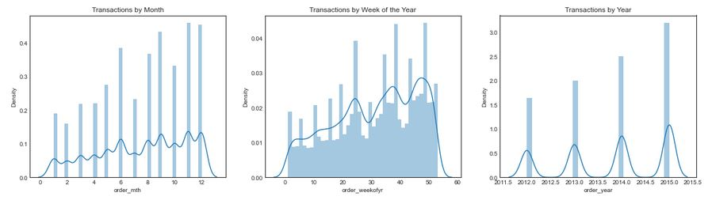

*Figure 1: Number of transactions on a monthly, weekly, and yearly basis*

Overall volume of transactions increased over the years from 2012 to 2015, which suggests growing affluence globally. There is also clear seasonality in sales, where months with the highest volume of transactions in *June, September, November* and *December*. This is expected with Christmas season, and bonus payout towards the end of the year. 

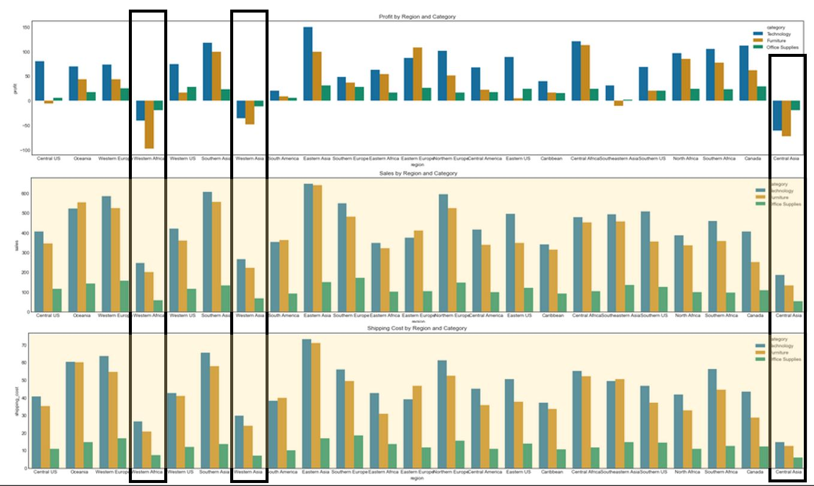

*Figure 2: Profit, Sales and Shipping cost of transactions, by region and category of items*

From Figure 2 above, we can see that `Western Africa`, `Western Asia` and `Central Asia` are unprofitable regions. These regions generally have lower sales and shipping cost.

Also, shipping costs very closely resemble sales amount for the respective regions. This may imply that shipping costs are a strong contributor to more sales. 

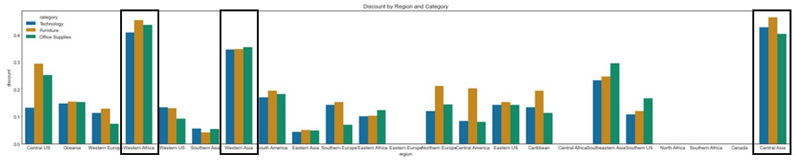

*Figure 3: Discount of transactions, by region and category of items*

Here we also see that the unprofitable regions have higher discounts, than other regions. 

Based on observations above, I engineered features to identify heavily discounted regions (>0.3%), non-profitable regions, and region which purchase relatively higher quantity (>3).

Customer segmentation analysis should also consider `Recency`, `Frequency` and `Monetary Value` (RFM) analysis.RFM segmentation allows marketers to target specific clusters of customers by communicating in a way that is more relevant based on the particular customer's behaviour based on RFM of the customer. By doing so, the Company can generate much higher response rates, increased loyalty and customer lifetime value (Optimove, 2020).

I attempt to identify if there are any obvious clusters, by creating new features which represent the `Recency`, `Frequency` and `Monetary Value` of transactions by customers. 

Following through from above analysis, I would expect some significant differences among regions, or between profitable regions and unprofitable regions. However, there does not seem to be any significant variance for me to glean any insights from RFM (Figure 4).

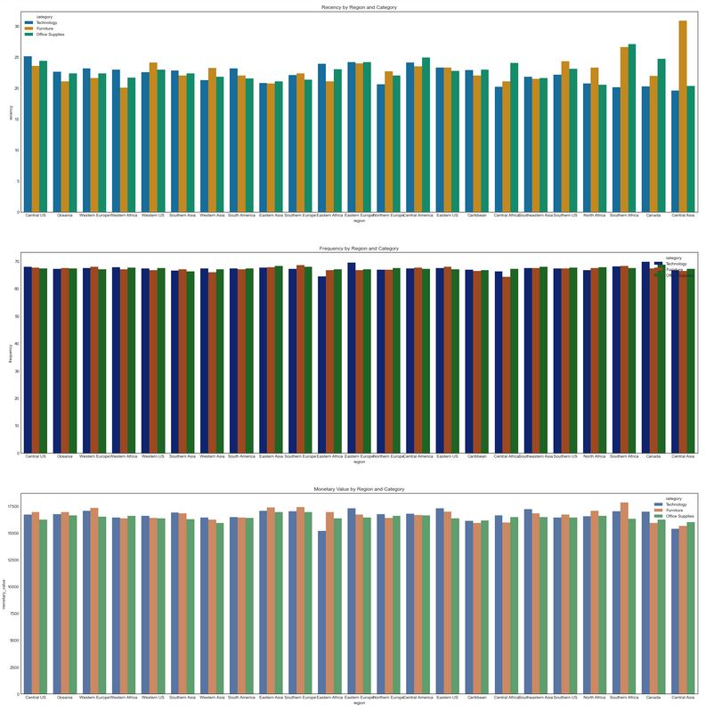

*Figure 4: Recency, Frequency and Monetary Value, by region and category of items*

Once all features are engineered, and data is clean, I used just the `Phones` subcategory transactions for further analysis. Outliers are removed and categorical variables are one hot encoded. 

#### [<ins>Clustering</ins>](code/02-modelling-clustering.ipynb)

Clustering algorithms like `KMeans` are distance-based algorithms so prior to running the model, I used a `MinMaxScaler` to scale the features, for a more accurate clustering result. 

To avoid any noise in the data that can affect clustering, I tried combinations of features, to eventually scale down to the more important ones for clustering. 

In this section, I performed clustering using three different clustering algorithms, `KMeans`, `DBSCAN` and `Agglomerative Clustering` to determine which one is appropriate to create good clusters within the data. 

##### <ins>KMeans</ins>

For KMeans, I have to feed the number of clusters and assess the silhouette score subsequently. I applied a range of 2 to 10 clusters to determine which number of clusters is the best, using the elbow method, inconjunction with the silhouette score. 

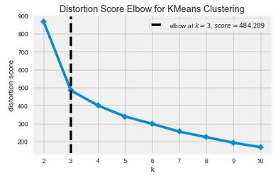

*Figure 5: Distortion score elbow across 2 to 10 clusters*

**Distortion score** is the sum of squared distances from each point to its assigned center (ie. sum of squared errors). The elbow method seeks to identify a point as number of clusters increase, where the distortion score start to flatten, forming the elbow. This is determined to be the ideal number of clusters for the data.

Figure 5 shows that 3 clusters is the ideal number of clusters. I plot the silhouette scores for 2 clusters to 4 clusters to assess if 3 clusters is indeed the one which best separates the clusters. 

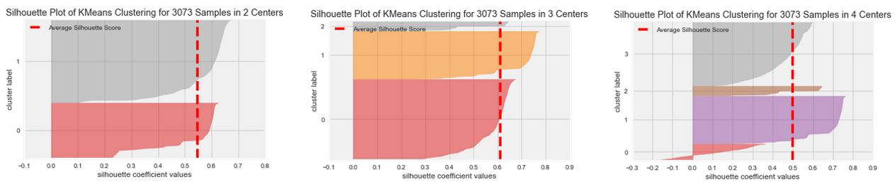

*Figure 6: Silhouette score of 2 to 4 clusters*

Figure 6 shows that 3 clusters has the highest silhouette score of ~0.61, compared to 2 clusters (~0.55) or 4 clusters (~0.5). I also view the intercluster distance (Figure 7) through multidimensional scaling (MDS) and noted that each cluster is clearly separated. From this, we can also infer that each of these clusters contain transactions with characteristics that are truly unique to each cluster. 

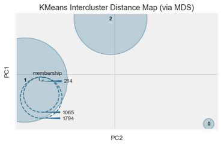

*Figure 7: Intercluster distance of 3 clusters, via multidimensional scaling (MDS)*

##### <ins>Density-based Spatial Clustering of Application with Noise (DBSCAN)</ins>

DBSCAN is well-suited for clustering data with minimal domain knowledge (unlike `k` in KMeans). It is also suited for discovering clusters with arbitrary shapes and is efficient on large databases.

DBSCAN clustering algorithm takes on two parameters :
- epsilon (`eps`); and
- minimum samples (`min_samples`)

Using nearest neighbours(Maklin, 2019), I determined the optimal `eps` to be 0.18. Using a minimum sample of 3, 10 and 100, the results are in Figure 8.

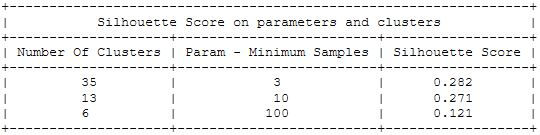

*Figure 8: Silhouette scores for minimum samples of 3, 10, and 100 using DBSCAN*

Silhouette scores are significantly lower than `KMeans`. The highest is 35 clusters with silhouette score of 0.282. This suggests that the dataset comprise data points with varying density.

I am unlikely to consider `DBSCAN` as the clustering model due to the very low silhouette score.

##### <ins>Agglomerative Clustering</ins>

Agglomerative Clustering groups objects based on their similarity. It works in a "bottom-up" manner whereby each object is initially considered as a single element cluster (leaf). At each step of the algorithm, the two clusters that are the most similar are combined into a new bigger cluster (nodes). This process is repeated until all points are a member of a single big cluster (Datanovia, n.d.)

Figure 9 shows the silhouette scores of a range of 2 to 10 clusters using agglomerative clustering and it also shows that 3 clusters is optimal, with the higher silhouette score of 0.61.

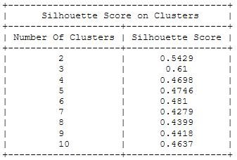

*Figure 9: Silhouette scores of 2 to 10 clusters made using agglomerative clustering*

##### Conclusion

`KMeans` and `Agglomerative Clustering` worked equally well to create 3 clusters of the dataset. Looking at neighbouring cluster numbers, it appears that `KMeans` did better, so I move forward with `KMeans` clusters. 

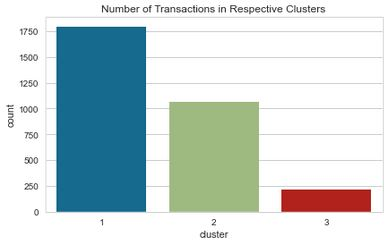

*Figure 10: Number of transactions in each cluster*

Majority of the transactions are classified under Cluster 1. 

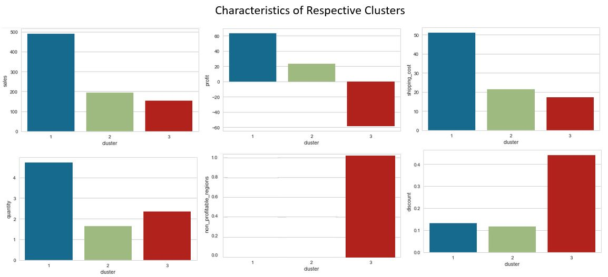

*Figure 11: Characteristics of each cluster*

| Feature | **Cluster 1** | **Cluster 2** | **Cluster 3** |
| :----: | :-------- | :-------- | :------- |
| Sales | Highest sales compared to other clusters with mean of about ~USD500 | Average sales of ~USD200 | Average sales of ~USD160 |
| Profit | Most profitable | Half as profitable | Non-profitable |
| Shipping Cost | Highest shipping cost imposed | Half the shipping cost as Cluster 1 | Lowest shiping cost |
| Quantity | Highest quantity purchased | Lower average quantity at about 1-2 | Lower average quantity purchased at about 2-3 |
| Discount | Relatively low discount average at about 0.1% | Similar to Cluster 1 | Huge discounts >0.4% |
| Regions | All regions except non-profitable regions | All regions except non-profitable regions | Non-profitable regions : `Western Africa`, `Western Asia` and `Central Asia` |

Based on these clusters, we see information that flows from EDA where:
- profitable cluster had the highest shipping cost,
- unprofitable cluster had the highest discounts,
- unprofitable cluster is coming from regions `Western Africa`, `Western Asia` and `Central Asia`

#### [<ins>Regression</ins>](code/03-modelling-regression.ipynb)

In this section, I perform multivariate regression on each cluster using algorithms `LassoCV`, `Elastic Net CV`, `RidgeCV`, `Random Forest Regressor`, `Support Vector Regressor` and `XG Boost Regressor`.

The objective is to obtain the regression line, from which I would be able to view how profit per unit changes with changes in unit price. For this coefficients and the y-intercept are needed so I will only consider `LassoCV`, `Elastic Net CV` or `RidgeCV` as the working model. The tree-based algorithms, `Random Forest Regressor` and `XG Boost Regressor`, and `Support Vector Regressor` are to assess how the data works with tree-based algorithms.

For each cluster, I split the data into training set and test set. I assess the R2 score of algorithms, using nested cross-validation with tuned hyperparameters. 

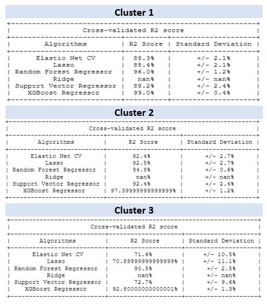

*Figure 12: Nested cross-validation R2 score of respective clusters*

From Figure 11, we can see that tree-based algorithms generally did better across all clusters and that `RidgeCV` could not work for all clusters probably because, its main use is for when predictor variables exceed the number of transactions which is not the case here.   

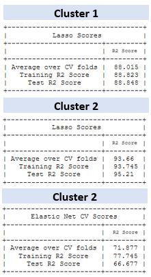

*Figure 13: R2 score of respective clusters' best model*

For Cluster 1, `LassoCV` works best and on unseen data, it is able to account for 88% of variability. Best working model for Cluster 2 is `Lasso CV` too, being able to account for 95% of variability of data. Cluster 3's best performing model is `Elastic Net CV`, being able to account for 66% of variability of data.  

## Conclusion and Recommendation

Taking the intercept and coefficients for each cluster's best model, I plot the regression line of profit per unit against unit price, in Figure 14 below. 

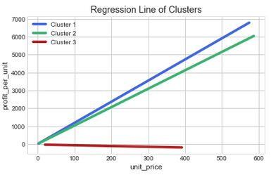

*Figure 14: Regression line for respective clusters*

If I were to set up a business and sell phones, I would avoid selling or operating at `Western Africa`, `Western Asia` or `Central Asia` as all phone transactions in these regions are not profitable at any unit price. Instead I would focus on other selling in other regions. 

Between Cluster 1 and Cluster 2, Cluster 1 comprise transactions with larger quantities purchased than Cluster 2. These are probably corporate consumers. To target these corporate consumers, I could consider providing bulk discounts or include free phone accessories if more phones are purchased. 

## Further Development

<ins>Consumer segmentation</ins>

Apart from clustering by transactions, another way to group purchases is by customer segmentation. This would require customer details to provide insights as to consumer purchase behaviour. For example, customer's spending score (ie. propensity to spend), age, income etc. 

<ins>Focused scope or broader scope</ins>

While the project focused on a particular product category, we can further develop the project by looking deeper within the product category like into specific brands, or specific phone models. The project can also be further developed by looking at other categories outside of phones.

## Limitations and Challenges

<ins>Nature of setting prices</ins>

While the project has attempted to price a product based purely on past data obtained, pricing is as much art as it is science (Masserman, 2021). There are many other external factors that influence prices for instance, branding, marketing and advertising strategies. The latest phone model should be priced much higher than older models, for the same brand. 

<ins>Scaling and monitoring</ins>

Consumer purchase behaviour changes over time, and so the model needs consistent monitoring. Scaling may be an issue because as time passes, more consumers are added to the database, and hence, much more processing power is needed to handle the huge amounts of data. We might end up with much more clusters with more data. 

## References

"How to Price Your Products" (Masserman, 2021)
https://www.inc.com/guides/price-your-products.html

"DBSCAN Python Example: The Optimal Value For Epsilon (EPS)" (Maklin, 2019)
https://towardsdatascience.com/machine-learning-clustering-dbscan-determine-the-optimal-value-for-epsilon-eps-python-example-3100091cfbc

"Agglomerative Hierarchical Clustering"(Datanovia, n.d.)
https://www.datanovia.com/en/lessons/agglomerative-hierarchical-clustering/

"Ridge Regression" (Statistics How To, 2017)
https://www.statisticshowto.com/ridge-regression/

----

# Data Dictionary

Below the description of Superstore data. This dataset comprise transactions of global retailers on products within the period 2012 to 2015.

| Features | Data Type | Description |
| :-------: | :--: | :---- |
| Row ID | int | unique identifier for each item purchased |
| Order ID | str | unique identifier for orders placed by a consumer |
| Order Date | datetime | date order was made or transaction date |
| Ship Date | datetime | date order was shipped |
| Ship Mode  | str | categorical variable of shipment class (ie. first class, second class, standard class or same day) |
| Customer ID | str | unique identifier assigned to customer based on orders|             
| Customer Name  | str | name of consumer |       
| Segment  | str  | type of purchase (ie. consumer, corporate or home office) |
| Postal Code | float | zip code based on location of purchase |
| City | str | city where purchase was made |                 
| State | str| state where purchase was made |                     
| Country | str | country where purchase was made |                  
| Region  | str | region where purchase was made |                
| Market | str | market where purchase was made |                 
| Product ID  | str  |  unique identifier for type of product |          
| Category | str  | category for product purchased |              
| Sub-Category | str   | sub-category for product purchased |            
| Product Name  | str  | product name for product purchased |           
| Sales | float | total sales for the transaction |
| Quantity  | int | quantity ordered for transaction |
| Discount | float | percentage discount used for transaction |
| Profit  | float | sales less discount and cost of transaction |
| Shipping Cost | float | shipping cost for the transaction |
| Order Priority | str | categorical vairable indicating high, medium, low or critical priority for the transaction |      

